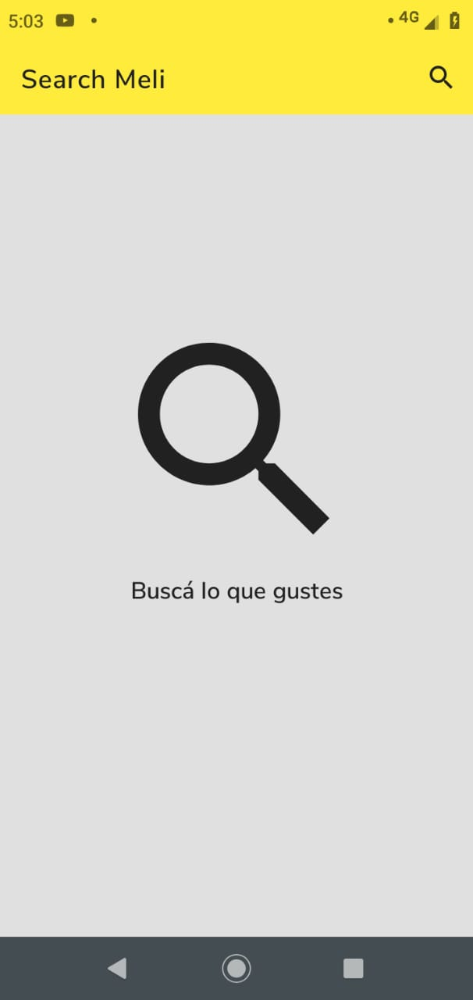
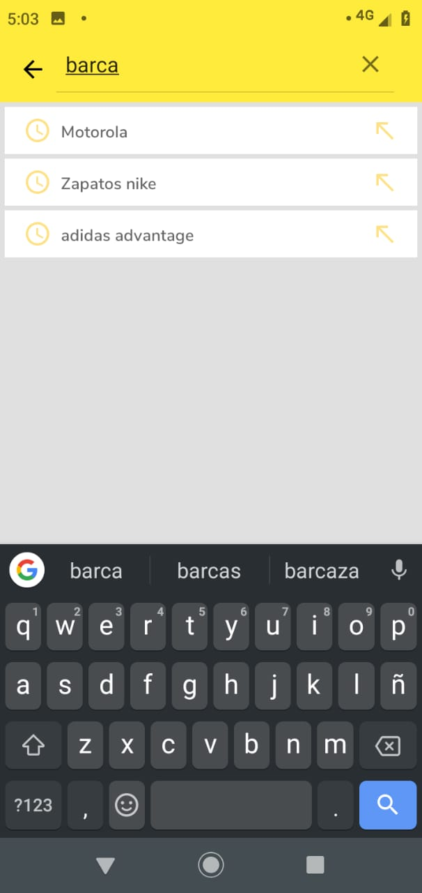
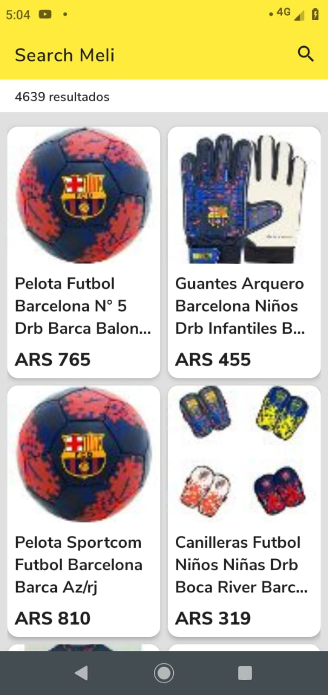
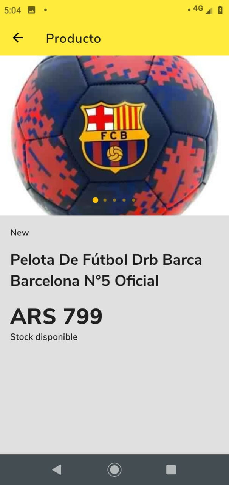

# search-meli - A challenge project

[] [][][][]

Android project to search for products and list of answers. It has been develop in Kotlin base on MVVM pattern and Clean Architecture with used of some libraries of Jetpack such as ViewModel, LiveData, ViewPager2. Also, Coroutines and Dagger2 as dependency injection

## Description
This project has been built with a base modular vision which it has two android modules: app and core  
app: it responsability is handle all code of presentation layer 
core: it responsability is handle all code of domain and data layers

## Screenshots
   

<h1>© 2020 Gabriel Pérez</h1>
